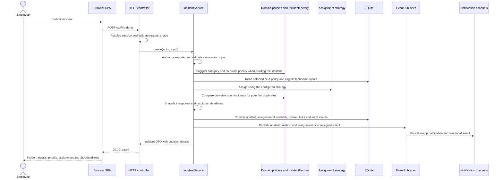

# BITS IT Support incident-creation sequence

```mermaid
sequenceDiagram
  actor E as Employee
  participant UI as Browser SPA
  participant API as HTTP controller
  participant IS as IncidentService
  participant INT as Domain policies and IncidentFactory
  participant AS as Assignment strategy
  participant DB as SQLite
  participant EVT as EventPublisher
  participant N as Notification channels

  E->>UI: Submit incident
  UI->>API: POST /api/incidents
  API->>API: Resolve session and validate request shape
  API->>IS: create(actor, input)
  IS->>IS: Authorize reporter and validate service and input
  IS->>INT: Suggest category and calculate priority when building the incident
  IS->>DB: Read selected SLA policy and eligible technician inputs
  IS->>AS: Assign using the configured strategy
  IS->>INT: Compare viewable open incidents for potential duplicates
  IS->>IS: Snapshot response and resolution deadlines
  IS->>DB: Commit incident, assignment if available, chosen links and audit events
  IS->>EVT: Publish incident creation and assignment or unassigned event
  EVT->>N: Persist in-app notification and simulated email
  IS-->>API: Incident DTO with decision details
  API-->>UI: 201 Created
  UI-->>E: Incident details, priority, assignment and SLA deadlines
```

Notification delivery follows the incident transaction. The [architecture](../architecture/ARCHITECTURE.md) shows the Smart Fix and SLA Rescue paths.
